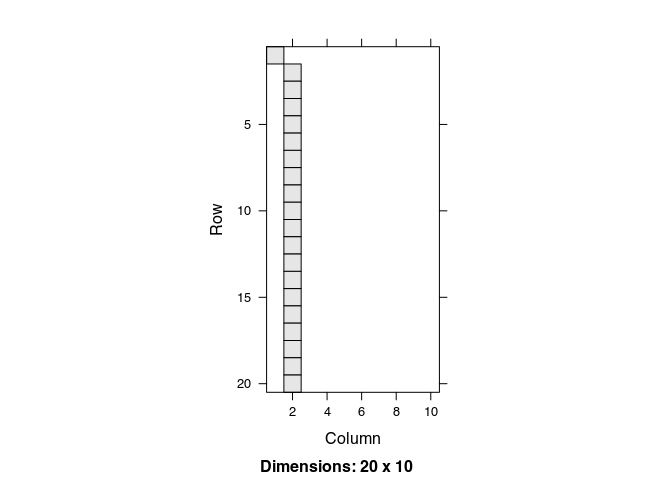

<!-- README.md is generated from README.Rmd. Please edit that file -->

# defm: Fit and simulate discrete binary exponential family models

<!-- badges: start -->

<!-- badges: end -->

Discrete exponential family models (DEFM) have a long tradition with
extensive development rooted in exponential random graph models (ERGMs.)
Applicable to any form o data that can be represented as binary arrays,
DEFMs provide a way to model jointly distributed binary variables.

This package, built on top of the C++ library
[`barry`](https://github.com/USCbiostats/barry), provides a
computationally efficient implementation of this family of models.

## Installation

You can install the development version of defm like so:

``` r
# FILL THIS IN! HOW CAN PEOPLE INSTALL YOUR DEV PACKAGE?
```

# Examples

## Example 1: Four outcomes

In this example, we will simulate a dataset that contains 1,000
individuals with four different outcomes. The outcomes, which are 0/1
vectors, will be modeled as Markov processes of order one. Future states
of this 0/1 vector are a function of the previous point in time. The
following lines simulate the baseline data:

``` r
library(defm)
#> Loading required package: stats4

# Simulation parameters
set.seed(1231)
n   <- 1000L # Count of individuals
n_y <- 4L    # Number of dependent variables
n_x <- 2L    # Number of independent variables

# Simulating how many observations we will have per individuals
n_reps <- sample(3:10, 1000, replace = TRUE)

# Final number of rows in the data
n_t <- sum(n_reps)

# Simulating the data
Y <- matrix(as.integer(runif(n_y * n_t) < .1), ncol = n_y)
colnames(Y) <- paste0("y", 1:n_y - 1)
X <- matrix(rnorm(n_x * n_t), ncol = n_x)
colnames(X) <- paste0("x", 1:n_x - 1L)
id <- rep(1L:n, n_reps)
```

Here is a brief look at the data structure. Remember, we still have not
actually simulated data **WITH THE MODEL**.

| id | y0 | y1 | y2 | y3 |          x0 |          x1 |
| -: | -: | -: | -: | -: | ----------: | ----------: |
|  1 |  0 |  0 |  0 |  0 |   1.9565904 |   0.0224265 |
|  1 |  0 |  0 |  0 |  0 | \-1.2255416 | \-1.7320384 |
|  1 |  0 |  0 |  0 |  0 |   0.1668458 | \-0.2145377 |
|  1 |  0 |  1 |  0 |  1 |   2.2339416 | \-0.1821917 |
|  2 |  1 |  0 |  0 |  0 | \-1.5118288 | \-0.3010826 |
|  2 |  0 |  1 |  0 |  0 |   0.6656071 |   1.3720245 |

For this example, we will simulate a model with the following features:

  - **Ones**: Baseline density (prevalence of ones).
  - **Ones x Attr 2**: Same as before, but weighted by one of the
    covariates. (simil to fixed effect)
  - **Transition** : And a transition structure, in particular `y0 ->
    (y0, y1)`, which will be represented as a matrix in the form:

<!-- end list -->

    1 0 0 0
    1 1 0 0

Here is the factory function:

``` r
# Creating the model and adding a couple of terms
build_model <- function(id., Y., X., order. = 1, par. = par.) {
  
  d_model. <- new_defm(id., Y., X., order = order.)

  term_defm_ones(d_model.)
  term_defm_ones(d_model., 1)
  
  transition <- matrix(NA_integer_, nrow = order. + 1, ncol = ncol(Y.))
  transition[c(1,2,4)] <- 1
  
  term_defm_transition(d_model., transition)
  
  init_defm(d_model.)
  
  d_model.
  
}
```

With this factory function, we will use it to simulate some data with
the same dimensions of the original dataset. In this case, the
parameters used for the simulation will be:

  - **Ones**: -2, i.e., low density,
  - **Ones x Attr 2**: 2, yet correlated with covariate \# 2,
  - **Transition** : 5, And a high chance of observing the transition
    `y0 -> (y0, y1)`

<!-- end list -->

``` r
sim_par <- c(-2, 2, 5)
d_model <- build_model(id, Y, X, order = 1, par. = sim_par)
simulated_Y <- sim_defm(d_model, sim_par)
head(cbind(id, simulated_Y))
#>      id        
#> [1,]  1 0 1 0 0
#> [2,]  1 0 0 0 0
#> [3,]  1 0 0 1 0
#> [4,]  1 1 0 0 0
#> [5,]  2 1 0 0 0
#> [6,]  2 1 1 0 1
```

Now, let’s see if we can recover the parameters using MLE:

``` r
d_model_sim <- build_model(id, simulated_Y, X, order = 1, par. = sim_par)
ans <- defm_mle(d_model_sim)

summary(ans)
#> Maximum likelihood estimation
#> 
#> Call:
#> stats4::mle(minuslogl = minuslog, start = start, method = "L-BFGS-B", 
#>     nobs = nrow_defm(object), lower = lower, upper = upper)
#> 
#> Coefficients:
#>                    Estimate Std. Error
#> # of ones         -1.999357 0.02749039
#> # of ones x attr1  2.015401 0.03047928
#> Motif 0 1 3        5.136348 0.09835722
#> 
#> -2 log L: 15032.66
```

We can also see the counts

| id | y0 | y1 | y2 | y3 |     x0 |     x1 | \# of ones | \# of ones x attr1 | Motif 0 1 3 |
| -: | -: | -: | -: | -: | -----: | -----: | ---------: | -----------------: | ----------: |
|  1 |  0 |  1 |  0 |  0 |   1.96 |   0.02 |         NA |                 NA |          NA |
|  1 |  0 |  0 |  0 |  0 | \-1.23 | \-1.73 |          1 |             \-1.73 |           0 |
|  1 |  0 |  0 |  1 |  0 |   0.17 | \-0.21 |          1 |             \-0.21 |           0 |
|  1 |  1 |  0 |  0 |  0 |   2.23 | \-0.18 |          2 |             \-0.36 |           0 |
|  2 |  1 |  0 |  0 |  0 | \-1.51 | \-0.30 |         NA |                 NA |          NA |
|  2 |  1 |  1 |  0 |  1 |   0.67 |   1.37 |          4 |               5.49 |           1 |
|  2 |  1 |  1 |  0 |  1 |   1.91 |   0.97 |          6 |               5.79 |           1 |
|  2 |  1 |  1 |  0 |  1 | \-0.67 |   0.66 |          6 |               3.99 |           1 |
|  2 |  1 |  1 |  0 |  0 | \-0.04 |   0.81 |          5 |               4.05 |           1 |
|  2 |  1 |  1 |  1 |  1 | \-0.76 |   1.37 |          6 |               8.20 |           1 |

## Example 2: A fun model

Let’s try out making some patterns

``` r
n   <- 20L
n_y <- 10L
id <- rep(1L, n)
Y <- matrix(0L, nrow = n, ncol = n_y)
Y[1] <- 1L
X <- cbind(1:n + 0.1)

d_model <- new_defm(id = id, Y = Y, X = X, order = 1)

for (i in (1:(n_y - 1) - 1)) {
  transition <- matrix(NA_integer_, nrow = 2, ncol = n_y)
  transition[c(1:4) + 2 * i] <- c(1,0,0,1)
  term_defm_transition(d_model, transition)
}

transition <- matrix(NA_integer_, nrow = 2, ncol = n_y)
transition[c(n_y * 2 - 1, n_y * 2, 1, 2)] <- c(1,0,0,1)
term_defm_transition(d_model, transition)

term_defm_ones(d_model)

init_defm(d_model)

Y_sim <-sim_defm(d_model, par = c(rep(100, n_y), -10))

stopifnot(all(Y_sim[1,] == Y[1,]))
```

Let’s see how it looks like



# Acknowledgement

This work was supported by the Assistant Secretary of Defense for Health
Affairs endorsed by the Department of Defense, through the Psychological
Health/Traumatic Brain Injury Research Program Long-Term Impact of
Military-Relevant Brain Injury Consortium (LIMBIC)
Award/W81XWH-18-PH/TBIRP-LIMBIC under Award No. I01 RX003443. The U.S.
Army Medical Research Acquisition Activity, 839 Chandler Street, Fort
Detrick MD 21702-5014 is the awarding and administering acquisition
office. Opinions, interpretations, conclusions and recommendations are
those of the author and are not necessarily endorsed by the Department
of Defense. Any opinions, findings, conclusions recommendations
expressed in this publication are those of the author(s) and do not
necessarily reflect the views of the U.S. Government, the U.S.
Department of Veterans Affairs or the Department of Defense and no
official endorsement should be inferred.

# Code of Conduct

Please note that the defm project is released with a [Contributor Code
of
Conduct](https://contributor-covenant.org/version/2/0/CODE_OF_CONDUCT.html).
By contributing to this project, you agree to abide by its terms.
